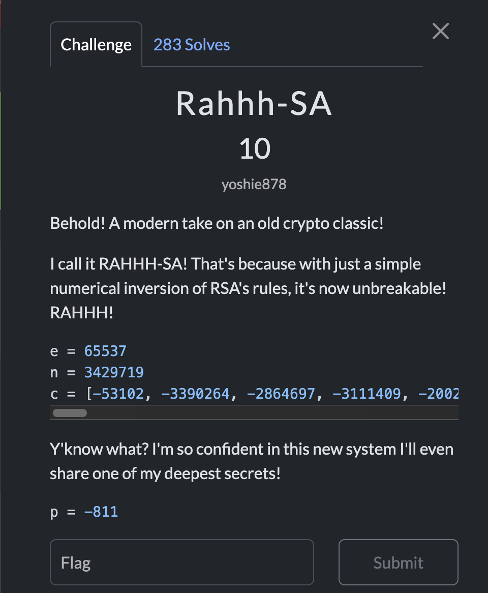
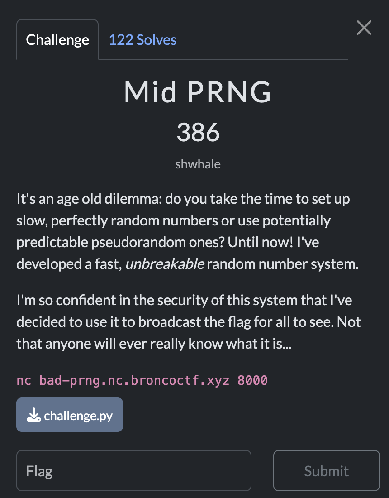

# BRONCO CTF 2025

 
# Cryptography  

## Challenge_1: Rahhh-SA  

### Challenge Description  



RSA implementation uses negative primes for encryption. 

**Provided Values**:
e = 65537

n = 3429719

p = -811

c = [-53102, -3390264, -2864697, -3111409, -2002688, -2864697, -1695722, -1957072, -1821648, -1268305, -3362005, -712024, -1957072, -1821648, -1268305, -732380, -2002688, -967579, -271768, -3390264, -712024, -1821648, -3069724, -732380, -892709, -271768, -732380, -2062187, -271768, -292609, -1599740, -732380, -1268305, -712024, -271768, -1957072, -1821648, -3418677, -732380, -2002688, -1821648, -3069724, -271768, -3390264, -1847282, -2267004, -3362005, -1764589, -293906, -1607693]

### Solution 
The challenge uses negative primes, but RSA operations remain valid by working with the absolute values of the primes.

 **Steps**  
1. *Factorize Prime*:  we have `p = -811`, so we can compute q by `q = n // abs(p) = 3429719 // 811 = 4229`.  
 Primes are `p = 811`, `q = 4229` 

2. *Compute phi*:  
   ```python
   phi = (811 - 1) * (4229 - 1) = 810 * 4228 = 3424680
3. *Private Key*: Calculate d = e⁻¹ mod phi(n) using Python's pow(e, -1, phi).

#### Exploit code:
```python
e = 65537
n = 3429719
c = [-53102, -3390264, -2864697, -3111409, -2002688, -2864697, -1695722, -1957072, -1821648, -1268305, -3362005, -712024, -1957072, -1821648, -1268305, -732380, -2002688, -967579, -271768, -3390264, -712024, -1821648, -3069724, -732380, -892709, -271768, -732380, -2062187, -271768, -292609, -1599740, -732380, -1268305, -712024, -271768, -1957072, -1821648, -3418677, -732380, -2002688, -1821648, -3069724, -271768, -3390264, -1847282, -2267004, -3362005, -1764589, -293906, -1607693]
p = -811

abs_p = abs(p)
abs_q = n // abs_p
phi = (abs_p - 1) * (abs_q - 1)

d = pow(e, -1, phi)

flag = []
for ci in c:
    c_pos = ci % n
    m = pow(c_pos, d, n)
    flag.append(chr(m))

print(''.join(flag))
```

#### Flag

bronco{m4th3m4t1c5_r34l1y_1s_qu1t3_m4g1c4l_raAhH!}


--------------------------------------------------------------------------------------------------------
--------------------------------------------------------------------------------------------------------

## Challenge_2: MID_PRNG

### Challenge description


**Challenge Files**
-[challenge.py](files/crypto/challenge.py)
**Connection**:  
```bash
nc bad-prng.nc.broncoctf.xyz 8000
```
### Solution:

The PRNG is likely a [Linear Congruential Generator](https://en.wikipedia.org/wiki/Linear_congruential_generator), which generates a deterministic sequence of numbers.
By exploiting known plaintext (flag starting with `bronco{`), we can Recover the initial keystream bytes, derive the LCG parameters (a and c), then generate the full keystream and finally decrypt the ciphertext

#### Exploit code:
```python
ciphertext_hex = "cc7871346d45054a0515efeebd35508a5ad5f9a8bd9e8a87" # got it from the connection
ciphertext = bytes.fromhex(ciphertext_hex)

known_plaintext = b"bronco{"
keystream_start = [ciphertext[i] ^ known_plaintext[i] for i in range(len(known_plaintext))]

# First 3 keystream bytes: [174, 10, 30]
x0, x1, x2 = keystream_start[:3]


possible_a = [3, 67, 131, 195]
valid_a, valid_c = None, None

for a in possible_a:
    c = (x1 - a * x0) % 256
    if (a * x1 + c) % 256 == x2:
        valid = True
        current = x2
        for i in range(3, len(keystream_start)):
            current = (a * current + c) % 256
            if current != keystream_start[i]:
                valid = False
                break
        if valid:
            valid_a, valid_c = a, c
            break

keystream = []
current = x0
for _ in range(len(ciphertext)):
    keystream.append(current)
    current = (valid_a * current + valid_c) % 256

# Decrypt
flag = bytes([c ^ k for c, k in zip(ciphertext, keystream)])
print(flag.decode())
```
#### Explanation

The decryption process begins by leveraging the known plaintext prefix `bronco{`. XORing the first 7 ciphertext bytes with this prefix reveals the initial keystream values: `[174, 10, 30, 90, 14, 42, 126]`. Using the first three keystream values `x₀=174, x₁=10, x₂=30`, we derive the LCG parameters by solving the congruences `10 ≡ (a*174 + c) mod 256` and `30 ≡ (a*10 + c) mod 256`. Subtracting these equations eliminates c, yielding `92a ≡ 20 mod 256`.
Solving this gives potential values for a `(3, 67, 131, 195)`. Testing each candidate, `a=3` and `c=0` validate against `x₂=30` and subsequent keystream bytes, confirming the LCG formula `xₙ₊₁ = (3xₙ) mod 256`. Using these parameters, the full keystream is generated, starting with `[174, 10, 30, 90, ...]`. Finally, XORing the entire ciphertext with this keystream reconstructs the flag.

#### FLAG

bronco{0k_1ts_n0t_gr34t}
